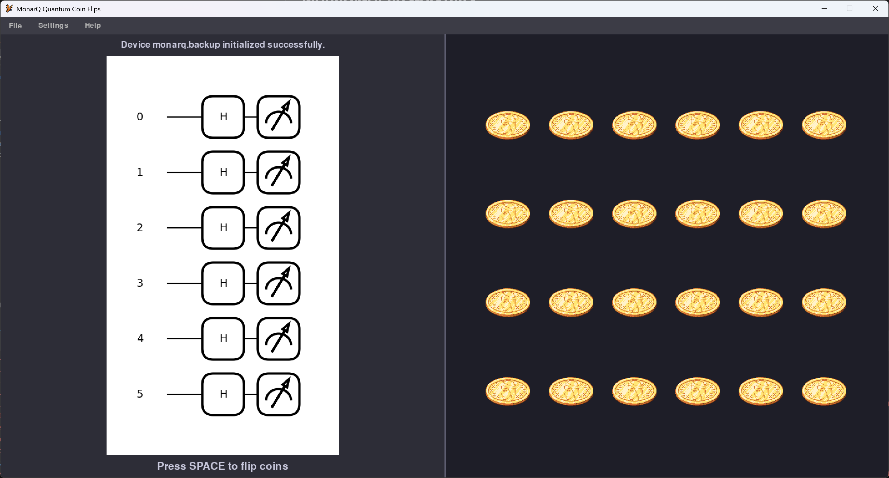

# MonarQ-Heads-or-Tails

MonarQ-Heads-or-Tails is a simple technology demonstration project showcasing a quantum coin flip using MonarQ, Calcul Québec's quantum computing platform.



## Overview

This project executes and animate a quantum coin flip using Pennylane-CalculQuebec and Pygame.
As it stands, the animations relied heavily on the assistance of generative AI tools.

## How to run

1. Clone the repository:

    ```bash
    git clone https://github.com/Scirelgar/MonarQ-Heads-or-Tails.git
    cd MonarQ-Heads-or-Tails
    ```

2. Install the required dependencies:

    ```bash
    pip install -r requirements.txt
    ```
   
3. To use the real hardware, ensure you have access to Calcul Québec's quantum computing platform. You then have to write you credentials in a `.env` file at the root of the project with the following format:

   ```env
   HOST='https://the.host.url'
   USER='username'
   ACCESS_TOKEN='your_access_token'
   ```

4. Run the application:

    ```bash
    python src/main.py
    ```
